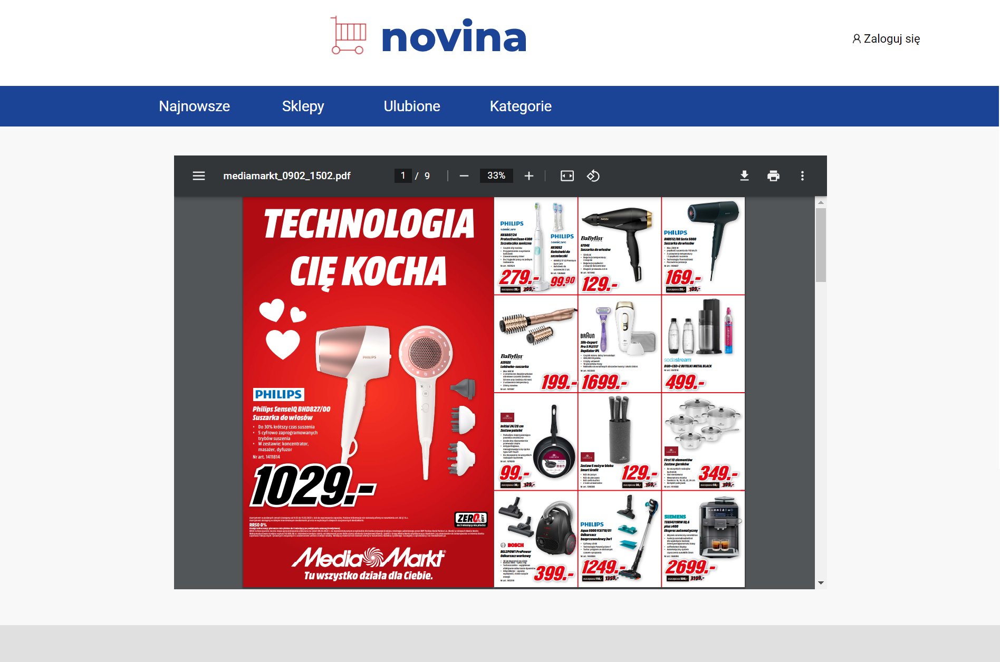
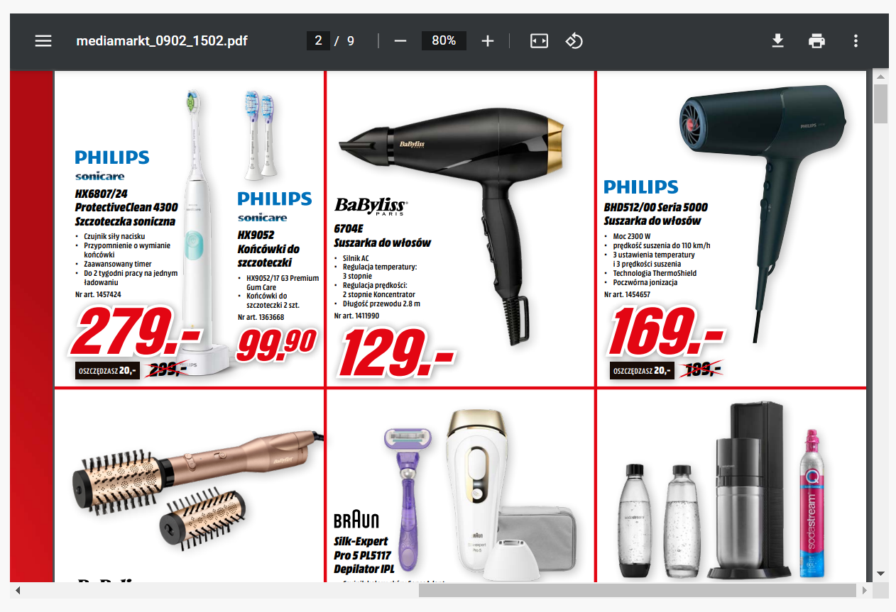

# _Novina_ - gazetki promocyjne najbardziej popularnych sklepów w jednym, wygodnym miejscu.

### Główna strona zawiera:
- Cztery najnowsze gazetki i przycisk 'Więcej', który przenosi użytkownika do strony ze wszestkimi gazetkrami.
- Cztery sklepy i przycisk 'Więcej', który przenosi użytkownika do strony ze wszestkimi sklepami.

# Menu aplikacji 
### Najnowsze 
Strona ze wszystkimi gazetkami. Po wybraniu gazetki aplikacja wyświetli jej zawartość.

### Sklepy
Strona ze wszystkimi sklepami. Klikając na konkretny sklep, aplikacja pokaże gazetki sklepu. Po wybraniu gazetki aplikacja wyświetli jej zawartość.

### Ulubione
Strona pokaże gazetki tych sklepów, których użytkownik obserwuje. Użytkownik musi być zalogowany.

### Kategorie
Na strone znajduje się rózne kategorie. Po wybraniu kategorii aplikacja wyświetli gazetki sklepów, pasujących do kategorii. Po wybraniu gazetki aplikacja wyświetli jej zawartość.

---
# Strona z wybraną gazetką

Jest możliwość zwiększenia stron.

### Logowanie/Rejestracja
Każda strona na górze zawiera przycisk 'Zaloguj się'. Po klikniściu użytkownika przenosi do strony logowania.

Jeśli użytkownik nie posiada konta, to naciska na 'Załóż konto'.
Po kliknięciu użytkownika przenosi do strony rejestracji.

