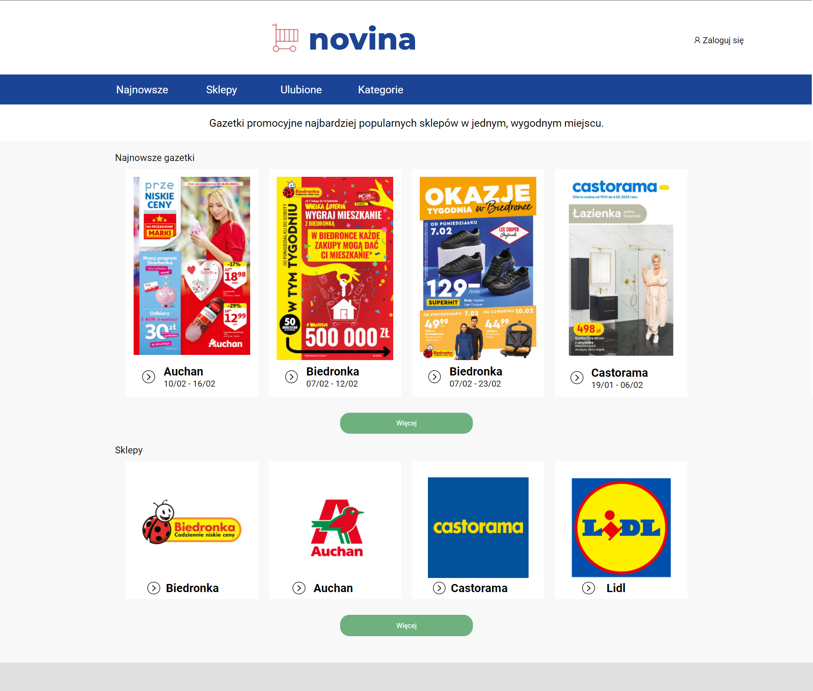
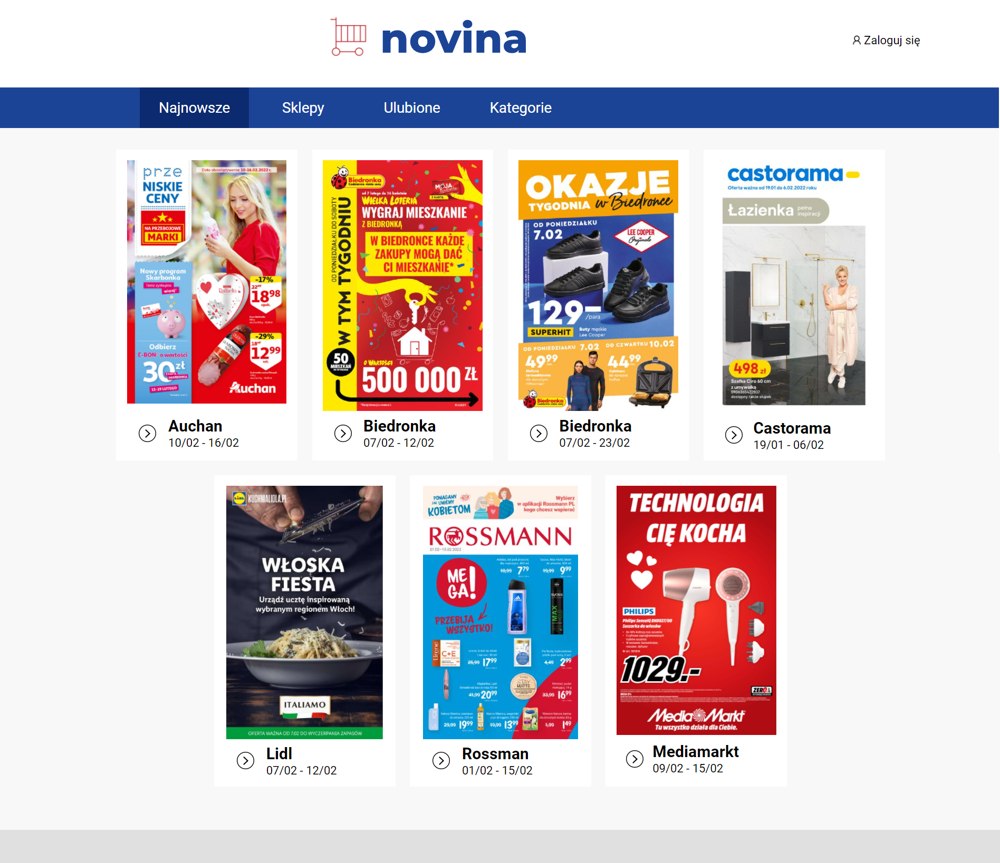
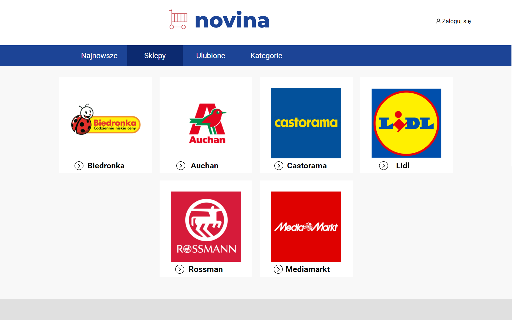
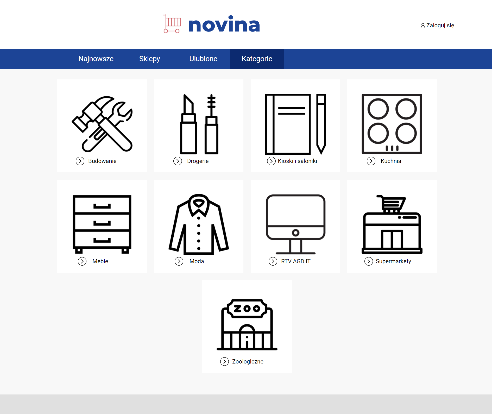
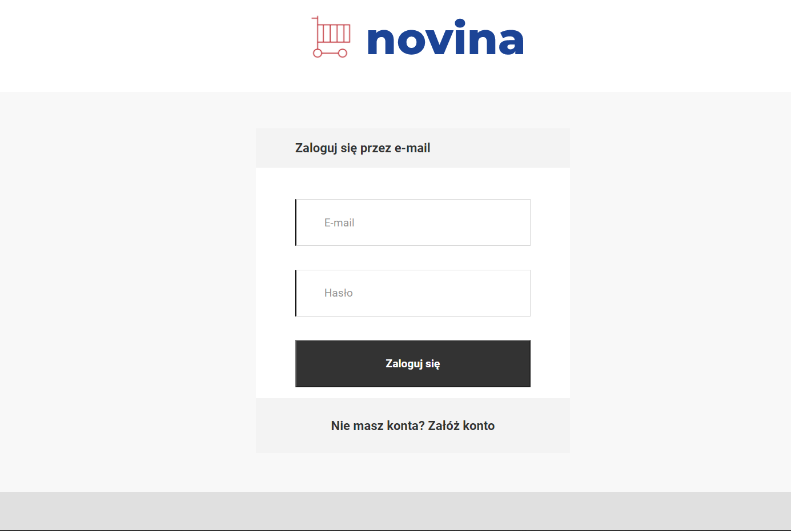
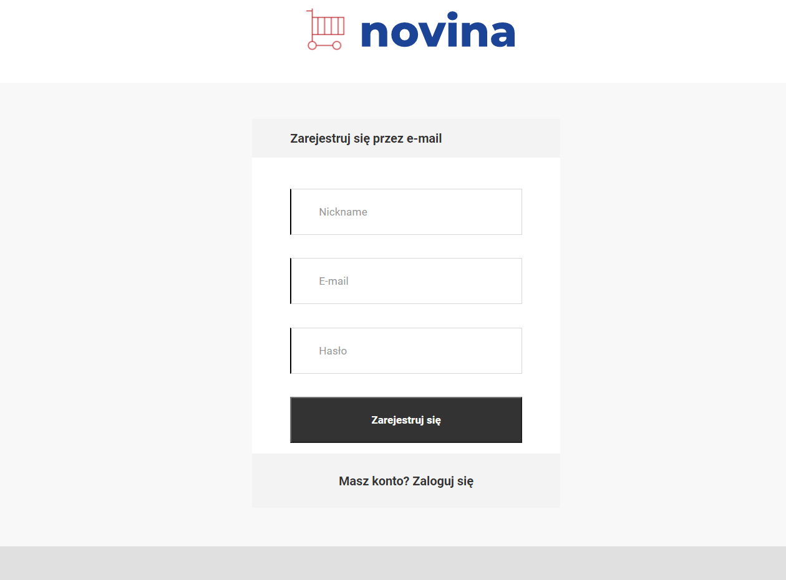

# _Novina_

#### Gazetki promocyjne najbardziej popularnych sklep?w w jednym, wygodnym miejscu.

---

## G??wna strona zawiera:
- Cztery najnowsze gazetki i przycisk 'Wi?cej', kt?ry przenosi u?ytkownika do strony ze wszestkimi gazetkrami.
- Cztery sklepy i przycisk 'Wi?cej', kt?ry przenosi u?ytkownika do strony ze wszestkimi sklepami.

# Menu aplikacji 
## Najnowsze 
Strona ze wszystkimi gazetkami. Po wybraniu gazetki aplikacja wy?wietli jej zawarto??.

## Sklepy
Strona ze wszystkimi sklepami. Klikaj?c na konkretny sklep, aplikacja poka?e gazetki sklepu. Po wybraniu gazetki aplikacja wy?wietli jej zawarto??.

## Ulubione
Strona poka?e gazetki tych sklep?w, kt?rych u?ytkownik obserwuje. U?ytkownik musi my? zalogowany.

## Kategorie
Na strone znajduje si? r?zne kategorie. Po wybraniu kategorii aplikacja wy?wietli gazetki sklep?w, pasuj?cych do kategorii. Po wybraniu gazetki aplikacja wy?wietli jej zawarto??.

---
## Logowanie/Rejestracja
Ka?da strona na g?rze zawiera przycisk 'Zaloguj si?'. Po klikni?ciu u?ytkownika przenosi do strony logowania.

Je?li u?ytkownik nie posiada konta, to naciska na 'Za??? konto'.
Po klikni?ciu u?ytkownika przenosi do strony rejestracji.

